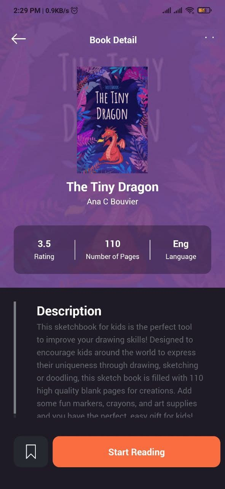

# BookStoreApp

### A book store app based on the design created by Piko on Dribbble
This is a book store app concept with a detailed overview of books, best selling lists, the latest books, and books coming out soon. In this concept, a user can view book details like the author, the description, rating, reading times, as well as how many people have read the book.
## Built With
* React Native
* Expo

## Screenshots

## Dribbble Link 

[Book Store App UI](https://dribbble.com/shots/14118636-Book-Store-App)
